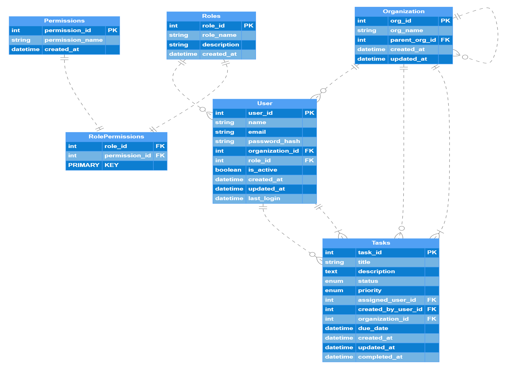
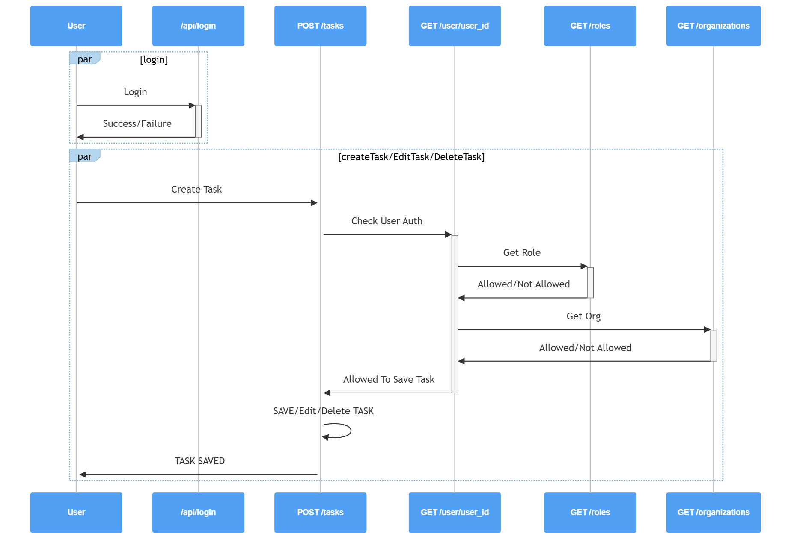

# 🚀 Secure Task Management System

A role-based task management system with JWT authentication and organizational hierarchy support.

### Core Features Implemented

- ✅ User authentication with JWT tokens
- ✅ RBAC system with role inheritance

## 🏗️ Architecture

### Planned NX Monorepo Structure

```
apps/
├── api/              # NestJS backend
└── dashboard/        # Angular frontend

libs/
├── shared/           # TypeScript interfaces & DTOs
└── auth/            # Reusable RBAC logic
```

### Current Implementation

Due to time constraints and my limited knowledge working with NX monorepo, I was only able to implement Register/Login Backend.

## 🗄️ Database Design

### Entity Relationship Diagram



### Access Control Flow



### API Endpoints

```
POST /auth/login
Content-Type: application/json

{
    "email": "test@example.com",
    "password": "password123"
}

Response: {
    "access_token": "jwt token",
    "permissions" : ["CREATE_TASK","SAVE_TASK","VIEW_TASK"] --- #TO BE SAVED INSIDE COOKIES FOR EASY ACCESS
    "expires_in": 2400
}

```

```

POST api/tasks
Content-Type: application/json
Authorization: Bearer {token}

{
"title": "Task EX 1",
"description": "Example Task",
"status": ["NEW", "IN-PROGRESS", "COMPLETE"],
"priority": 1,
"assigned_user_id": <null>,
"created_by_user_id": 2,
"organization_id": 1,
"due_date": <null>,
"create_at": date,
"updated_at": date,
"completed_at": date
}

```

```

POST api/create_task
Content-Type: application/json
Authorization: Bearer {token}

{
"title": "Task EX 1",
"description": "Example Task",
"status": ["NEW", "IN-PROGRESS", "COMPLETE"],
"priority": 1,
"assigned_user_id": <null>,
"created_by_user_id": 2,
"organization_id": 1,
"due_date": <null>,
"create_at": date,
"updated_at": date,
"completed_at": date
}

```
